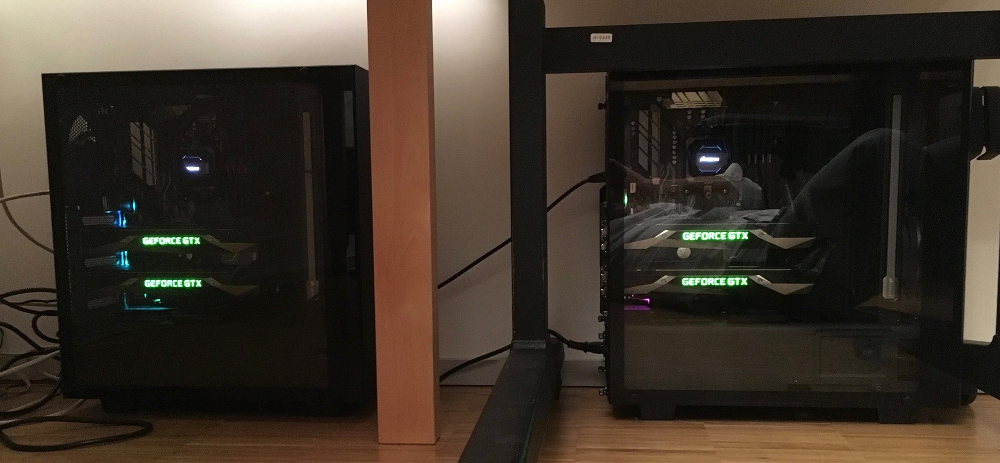

# Project Ellie



## !!! STILL UNDER CONSTRUCTION !!!

#### Eventually, I'll host Project Ellie's version of Geoffrey Hinton's capsnet here.
Just in case you wondered: [*"Ellie" is the little girl that broke your f...ing finger!*](https://www.youtube.com/watch?v=nP6k_PaUW84&t=570)

No, honestly, Ellie is just short for Elektra". You know, when Mum called you by your full name,
that typically meant trouble ahead. Thus, in favour of a peaceful relationship with my cluster, 
I chose to call it 'Ellie'. 

...At times, though, I'm getting close to changing my mind... ;-)

### Distributed tensorflow on Kubernetes with multiple GPUs
 
This github project contains the sources for a kubernetes-based GPU-enabled, distributed tensorflow cluster. You can tell
what's going on by consulting the various docker files, kubernetes ymls, and the Jenkinsfile


## Preparation
First, you want to create a python virtual environment. We assume that there is an executable "python3" 
installed somewhere. You can try to resort to other executables by editing the very first line
of the init_env script.

In the project root directory, run 
```
$ source shell/init_env [--use-gpu] [choose_a_name_for_your_virtual_environment]
``` 
to create a virtual environment and add utilties from ./shell. Note that using --use-gpu 
will attempt to install a tensorflow version that requires NVIDIA's libcuda 9.0+ installed.

## Build

At best, you start from Jenkinsfile that describes the build process.

There are various docker images to be built in this project
 - A variety of model trainers that can run as kubernetes jobs
 - A flask web application that uses some of the models

### Trainers
build with
```
$ docker build -t <your_dockerhub_name>/<image_name>
```

Note that you may need to push the image into a repo to make it available for kubernetes deployment.
